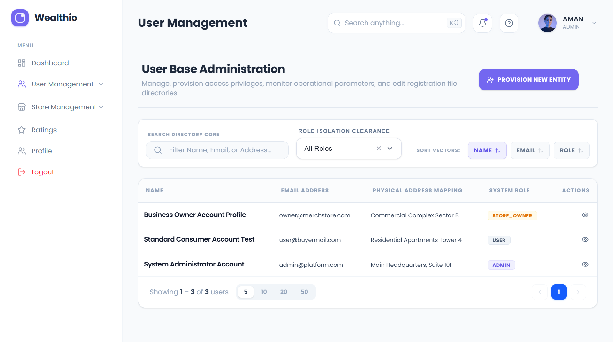
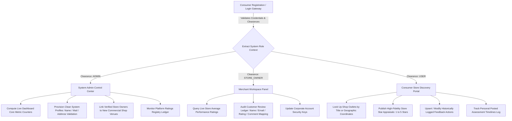

# Store Rating & Analytics Platform

A secure, multi-tenant Full-Stack Store Discovery and Rating Management system built with Node.js (Express), PostgreSQL, React, TypeScript, and Tailwind CSS. The platform supports hierarchical role-based access control (RBAC) separated into System Administrators, Store Owners (Merchants), and Normal Users (Consumers).

## 📊 System Overview Blueprint

--- 



---

## 🚀 Key Features by Access Level

### 1. System Administrator Dashboard

* **Dynamic Analytics Panel**: Displays systemic high-level counters including total system users, registered store venues, and submitted ratings.
* **User Provisioning Core**: Admin privileges to initialize new system identities (Admin, Store Owner, User) under strict credential encryption regulations.
* **Commercial Asset Registry**: Register commercial outlets and link them directly to verified, unassigned merchant profiles.
* **Global Ratings Ledger**: Audit logs of all reviews across the platform with server-side sorting parameters (Date, Score) and filtering capabilities.

### 2. Store Owner / Merchant Workspace

* **Merchant Analytics Hub**: Displays live metrics detailing corporate performance score indexing, absolute review counts, and recent velocity statistics.
* **Customer Review Feed**: Deep-dive access ledger to inspect customer client profiles, scores given, and specific written commentary narratives.
* **Credential Protection Control**: Secure password change forms enforcing complexity guidelines.

### 3. Normal User / Consumer Portal

* **Interactive Store Directory**: Browse and discover business entities using real-time query searching across store labels and geographic parameters.
* **Feedback Lifecycle Engine**: Submit high-fidelity feedback (1-5★) or adapt historically submitted reviews inside a customized modal drawer overlay.
* **Personal Logs Terminal**: View past interaction logs, scores given, and timeline submission coordinates.

---

## 🛠️ Technology Stack

| Architecture Layer | Core Technology Components |
| --- | --- |
| **Frontend Framework** | React 18, TypeScript, Vite |
| **State & Remote Fetching** | TanStack React Query v5, Formik, Yup, Zustand |
| **Styling & UI Components** | Tailwind CSS, Lucide React Icons |
| **Backend Core** | Node.js, Express.js (ES Modules syntax) |
| **Database Management** | PostgreSQL (Relational Pooling Driver `pg`) |
| **Authentication & Security** | JWT (HttpOnly Cookies Session Rotation), Bcrypt (12 Rounds Hashing) |
| **API Documentation** | OpenAPI 3.0 via Swagger UI Runtime Engine |

---

## 📁 Architecture & Directory Tree

```bash
├── backend/
│   ├── src/
│   │   ├── common/            # Shared operational wrappers (AppError, asyncHandlers)
│   │   ├── config/            # PostgreSQL Connection Pool & Environment configurations
│   │   ├── docs/              # Swagger Open API specifications asset map
│   │   ├── middlewares/       # Session parsing, Role guards, Request validators
│   │   ├── modules/           # Isolated domain features (routes, controllers, services)
│   │   │   ├── admin/         # Administrative registry controls
│   │   │   ├── auth/          # Profile lifecycle credentials workflows
│   │   │   ├── owner/         # Merchant performance ledger query routines
│   │   │   └── rating/        # Consumer feedback engines
│   │   ├── app.js             # Express core setup with security configurations
│   │   └── server.js          # Main process initial server boot script
│   └── package.json
└── frontend/
    ├── src/
    │   ├── common/            # Shared visual modules (Sidebar, Navbar, Custom Modals)
    │   ├── components/        # View sheets grouped by systemic permissions matrix
    │   │   ├── ADMIN/         # User Management, Store Registry, Ratings Core
    │   │   ├── OWNER/         # Merchant Dashboards, Profile Sheets, Review Feeds
    │   │   └── USER/          # Store Discovery, Ratings Feed components
    │   ├── constants/         # Centralized API endpoint configurations
    │   ├── hooks/             # Custom React Query mutation and query wrappers
    │   ├── routes/            # Protection layers and conditional authorization guards
    │   ├── store/             # Zustand persistent global auth context sheet
    │   └── utils/             # Helpers (makeRequest, showToast, input validation)
    └── package.json

```

---

## 🔒 Rigorous Data Validation & Safety Constraints

To comply with database design principles and project criteria, validations are strictly enforced on both client and server layers:

* **Full Names Profile**: Bound to a minimum range threshold of `20` up to a maximum index arrays threshold of `60` standard string characters.
* **Physical Addresses Mappings**: Fixed ceiling constraints allowing a maximal index boundary width of `400` characters.
* **Secure Encryption Passwords**: Restricted boundaries between `8` and `16` array bits length requiring at least one **Uppercase alphabetic character** and one **Special notation glyph**.
* **Evaluation Indexes**: Constrained precisely between integers range `1` to `5` stars limits.

---

## 🔌 API Route Reference Blueprint

### 🔐 Authentication Module

* `POST /api/v1/auth/register` — Initial consumer onboarding signup.
* `POST /api/v1/auth/login` — Verifies identity and sets HttpOnly context tokens.
* `GET /api/v1/auth/me` — Fetches verified profile metadata for current user.
* `PATCH /api/v1/auth/change-password` — Rotates and updates security keys.

### 👑 Admin Control Matrix

* `GET /api/v1/admin/dashboard-stats` — Computes analytics counters.
* `GET /api/v1/admin/users` — Queries platform registry directory with filters.
* `POST /api/v1/admin/stores` — Provisions brand new business assets.
* `GET /api/v1/admin/unassigned-owners` — Finds active store owners without store mappings.
* `GET /api/v1/admin/ratings` — Central database audit pipeline for reviews.

### 🛍️ User / Store Feedback Routing

* `GET /api/v1/user/stores` — Location discovery catalog for normal users.
* `POST /api/v1/user/submit` — Handles upsert modifications on feedback scores.
* `GET /api/v1/user/history-log` — Returns user's own submitted review logs.

### 📈 Store Owner Operations

* `GET /api/v1/owner/dashboard` — Returns aggregate performance metrics.
* `GET /api/v1/owner/ratings` — Returns complete details of customers who rated the store.

---

## ⚡ Setup & Local Installation

### Prerequisites

* Node.js environment installed (`v18+` recommended).
* Active local or remote PostgreSQL instances database running server.

### Backend Configurations

1. Navigate to your backend execution context subdirectory:
```bash
cd backend

```


2. Install external package architectures cleanly:
```bash
npm install

```


3. Establish a standard configuration file named `.env` in the root folder of the backend:
```env
PORT=8080
NODE_ENV=development
DATABASE_URL=postgresql://<username>:<password>@localhost:5432/<database_name>
JWT_SECRET=your_super_secure_access_secret_key_stream
JWT_REFRESH_SECRET=your_super_secure_refresh_secret_key_stream
JWT_EXPIRES_IN=15m
JWT_REFRESH_EXPIRES_IN=7d

```


4. Hydrate the local database schema configurations directly using the database source setup file:
```bash
psql -U postgres -d <your_db_name> -f src/schema.sql

```


5. Spin up the application engine processes:
```bash
npm run dev

```


### Frontend Workspace Installation

1. Move outward towards your frontend directory sheet:
```bash
cd ../frontend

```


2. Fetch relevant development package node dependencies:
```bash
npm install

```


3. Set up the development endpoint proxy target pointer variables via a local `.env` setup:
```env
VITE_API_BASE_URL=http://localhost:8080/api/v1

```


4. Boot up your client development host server thread:
```bash
npm run dev

```


---

## 📝 Interactive API Playground Audit

Once the backend runtime server engine initializes, access live OpenAPI interactive payload descriptions at:

```http
http://localhost:8080/api/v1/docs

```

---

### Default Seed Credentials

All accounts are pre-configured in the system database with the same secure password parameter:

* **Default Password:** `SecurePass123!`

| System Role | Account Registration Name | Identification Email Link |
| --- | --- | --- |
| **System Administrator** | `System Administrator Account` | `admin@platform.com` |
| **Store Owner (Merchant)** | `Business Owner Account Profile` | `owner1@merchstore.com` |
| **Normal User (Consumer)** | `Standard Consumer Account Test` | `user1@buyermail.com` |

---

### Project Execution & Data Flow Blueprint

The application employs a unified, single-gateway entry authentication node that evaluates account credentials, injects a security context token, and securely routes the session layout based on the account's authorization role clearance:

